# 📒 Rubrica Telefonica

Questo progetto è una semplice **rubrica telefonica da terminale**, sviluppata in Python, che permette di:

- 📖 Visualizzare tutti i contatti
- ➕ Aggiungere nuovi contatti
- ✏️ Modificare contatti esistenti
- ❌ Eliminare contatti
- 🔍 Cercare contatti
- 💾 Effettuare backup
- 🚪 Uscire in modo sicuro

I contatti vengono salvati nel file `rubrica_telefonica.txt` in formato .txt e ogni voce è identificata da un codice.
```python
path_rubrica = "rubrica_telefonica.txt"
if os.path.exists(path_rubrica):
    pass
else:
    with open(path_rubrica, "w", encoding='utf-8') as file:
        pass

    # Lettura della rubica telefonica
with open(path_rubrica, "r", encoding='utf-8') as file:
    for line in file:
        codice, nome, cognome, numero, mail, data_creazione = line.split(",")
        contatti[codice] = {
            "Nome" : nome.strip(),
            "Cognome" : cognome.strip(),
            "Numero" : numero.strip(),
            "Mail": mail.strip(),
            "Data di creazione": data_creazione.strip()
            } 

```

---

## 🧭 Menu Principale


</details>

### Visualizza rubrica

Nel terminale vengono restituiti tutti i contatti presenti in rubrica, solo nel caso di rubrica non vuota. 

```python
if contatti:
            print(f"RUBRICA: \n ")
            print(f"Codice \t Nome  \t Cognome \t Numero  \t Mail  ")
            print(f" {"-"*30} \n")
            for codice, contatto in contatti.items():
                print(f"{codice} \t {contatto['Nome']} \t {contatto['Cognome']} \t{contatto['Numero']} \t{contatto['Mail']} ")
        else:
            print("Rubrica vuota")
```


### Aggiungi Contatto

Viene chiesto all'utente di inserire i dati (nome, cognome, numero, mail). Il programma effettua i dovuti controlli per ogni campo:
- nome, cognome: più di 3 caratteri
- numero: esatamente 10 valori
- mail: deve contenere @
Il codice corrispondente viene generato. Se il codice è già presente, viene chiesto all'utente se vuole sovrascrivere. In caso di risposta affermativa (o di codice non precedentemente presente), il contatto viene salvato in rubrica.


```python
nuovo_codice = nuovo_nome[:2].upper() + nuovo_cognome[:2].upper() + nuovo_numero[-4: ]

        # Gestione della creazione o della sovrascrittura del contatto.
        print(contatti.keys())
        if nuovo_codice in contatti:
            scelta_modifica = input("Contatto esistente. Vuoi sovrascrivere?(s/n): ").strip().lower()
            if scelta_modifica != "s":
                print('no modifica')
                continue


        with open(path_rubrica, "w") as file:
            # file.write(f"codice, nome, cognome, numero, mail, data_creazione\n")
            for codice, contatto in contatti.items():
                file.write(f"{codice}, {contatto['Nome']}, {contatto['Cognome']}, {contatto['Numero']}, {contatto['Mail']}, {data_creazione}")
```



```mermaid
flowchart LR
    A[Inserimento dati
    con controllo] --> E[Generazione 
    codice contatto]
    E --> F{Codice già esistente?}
    F -- No --> G[Salva nuovo contatto]
    F -- Sì --> H{Sovrascrivere?}
    H -- Sì --> G
```

### Modifica Contatto

Viene chiesto all'utente di inserire il codice del contatto che vuole modificare. 
Se il codice è già presente in rubrica, chiede all'utente di inserire i nuovi dati. I controlli sui nuovi dati sono gli stessi del punto precedente. Un nuovo codice corrispondente viene generato. Viene chiesto all'utente se vuole sovrascrivere. In caso di risposta affermativa, il contatto viene salvato in rubrica.


```python
 nuovo_codice = nuovo_nome[:2].upper() + nuovo_cognome[:2].upper() + nuovo_numero[-4: ]
            cambio_codice = input(f"Cambiare il vecchio codice {codice_modifica} in {nuovo_codice}? (s/n) ")
            if cambio_codice == "s":
                codice = nuovo_codice
            else:
                codice = codice_modifica
```


### Elimina Contatto

Viene chiesto all'utente di inserire il codice del contatto che vuole eliminare. Se contatto presente in rubrica, questo viene eliminato.


```python
if codice_elimina not in contatti.keys():
            print("Nessuno contatto esistente con questo codice.")
            continue
        else:
            print(f"contatto con codice {codice_elimina} e nome {contatti[codice_elimina]["Nome"]} eliminato")
            contatti.pop(codice_elimina)
```


### Cerca Contatto

```mermaid
flowchart TD
    A[Cerca contatto] --> B{Metodo di ricerca}
    B --> C1[Per Codice]
    B --> C2[Per Nome]
    B --> C3[Per Cognome]
    
    C1 --> D1{Codice trovato?}
    D1 -- Sì --> E1[Mostra dati]
    D1 -- No --> F1[Errore: non trovato]

    C2 --> D2[Loop su tutti i contatti]
    D2 --> E2[Mostra se trovato]
    D2 --> F2[Errore se non trovato]

    C3 --> D3[Loop su tutti i contatti]
    D3 --> E3[Mostra se trovato]
    D3 --> F3[Errore se non trovato]
```

